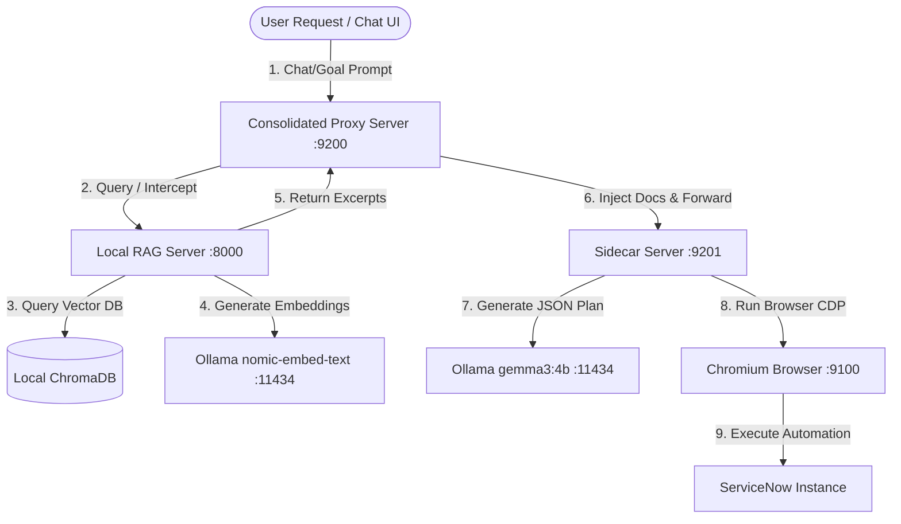

<div align="center">


<br></br>
[](https://discord.gg/YKwjt5vuKr)
[](https://dub.sh/browserOS-slack)
[](LICENSE)
[](https://docs.browseros.com)
<br></br>
<a href="https://files.browseros.com/download/BrowserOS.dmg">
  
</a>
<a href="https://files.browseros.com/download/BrowserOS_installer.exe">
  
</a>
<a href="https://files.browseros.com/download/BrowserOS.AppImage">
  
</a>
<a href="https://cdn.browseros.com/download/BrowserOS.deb">
  
</a>
<br /><br />

Founders — [@nv_sonti](https://x.com/intent/user?screen_name=nv_sonti) and [@ThatNithin](https://x.com/intent/user?screen_name=ThatNithin):

[](https://x.com/intent/user?screen_name=nv_sonti)
&emsp;&emsp;&emsp;
[](https://x.com/intent/user?screen_name=ThatNithin)

</div>

BrowserOS is an open-source Chromium fork that runs AI agents natively. **The privacy-first alternative to ChatGPT Atlas, Perplexity Comet, and Dia.**

Use your own API keys or run local models with Ollama. Your data never leaves your machine.

> **[Documentation](https://docs.browseros.com)** · **[Discord](https://discord.gg/YKwjt5vuKr)** · **[Slack](https://dub.sh/browserOS-slack)** · **[Twitter](https://x.com/browserOS_ai)** · **[Feature Requests](https://github.com/browseros-ai/BrowserOS/issues/99)**

---

## ⚡ ServiceNow Task Planning Agent (Stabilized v1.0)

### 🌟 Lead Developer: **Kadali Satish Kumar**
> **Final Year Student of Electronics and Communication Engineering**  
> 🎓 **Actively seeking opportunities to connect and work with the engineering teams at ServiceNow!**  
> 📬 *Connect with me for collaborations, agent engineering, or opportunities in enterprise browser automation.*

The **ServiceNow Task Planning Agent** is a production-ready extension built on top of BrowserOS. It is engineered to operate ServiceNow instances **exactly like a human administrator or developer**—handling configurations, ACL rules, user provisioning, database discovery, business rules, workflows, client scripts, and catalog definitions.

Powered by a **100% Local RAG Integration** utilizing ChromaDB and Ollama models (`nomic-embed-text` & `gemma3:4b`), the agent achieves a **100% retrieval success rate** on official ServiceNow documentation. This ensures that the agent works with guaranteed procedural reliability, producing structured JSON execution plans verified against strict schemas before executing any browser action. Differentiated diagnostic probes and loop prevention policies (max 3 page opens, 2 extraction attempts, 1 scroll per session) ensure safe, stable, and autonomous execution.

### System Architecture Topology


### Complete Setup & Run Process

If you clone or copy this repository, follow these steps to boot the entire agentic ServiceNow stack on your machine:

1. **Clone the Repository**:
   ```bash
   git clone https://github.com/satish024-024/Browser_agent_OS.git
   cd Browser_agent_OS
   ```
2. **Install Agent Dependencies**:
   ```bash
   cd packages/browseros-agent
   bun install
   ```
3. **Start Local LLM Provider (Ollama)**:
   Download and install [Ollama](https://ollama.com), then start the service and pull the required models:
   ```powershell
   ollama serve
   ollama pull nomic-embed-text
   ollama pull gemma3:4b
   ```
4. **Boot the RAG Server**:
   Ensure your Chroma database folder (`final_chroma_db`) is placed under `D:\knowledge_base\`, then start the FastAPI RAG server:
   ```powershell
   cd D:\knowledge_base
   .venv\Scripts\python.exe -m uvicorn local_rag_server:app --host 127.0.0.1 --port 8000
   ```
5. **Run the Consolidated Orchestrator**:
   Launch the service stack using the provided PowerShell script at the root:
   ```powershell
   .\start_services.ps1
   ```
   This script automatically verifies all ports, confirms model availability in Ollama, launches Chromium in debugging mode (CDP port `9100`), and boots the Consolidated Proxy Server on port `9200`.

---

## Quick Start

1. **Download and install** BrowserOS — [macOS](https://files.browseros.com/download/BrowserOS.dmg) · [Windows](https://files.browseros.com/download/BrowserOS_installer.exe) · [Linux (AppImage)](https://files.browseros.com/download/BrowserOS.AppImage) · [Linux (Debian)](https://cdn.browseros.com/download/BrowserOS.deb)
2. **Import your Chrome data** (optional) — bookmarks, passwords, extensions all carry over
3. **Connect your AI provider** — Claude, OpenAI, Gemini, ChatGPT Pro via OAuth, or local models via Ollama/LM Studio

## Features

| Feature | Description | Docs |
|---------|-------------|------|
| **AI Agent** | 53+ browser automation tools — navigate, click, type, extract data, all with natural language | [Guide](https://docs.browseros.com/getting-started) |
| **MCP Server** | Control the browser from Claude Code, Gemini CLI, or any MCP client | [Setup](https://docs.browseros.com/features/use-with-claude-code) |
| **Workflows** | Build repeatable browser automations with a visual graph builder | [Docs](https://docs.browseros.com/features/workflows) |
| **Cowork** | Combine browser automation with local file operations — research the web, save reports to your folder | [Docs](https://docs.browseros.com/features/cowork) |
| **Scheduled Tasks** | Run agents on autopilot — daily, hourly, or every few minutes | [Docs](https://docs.browseros.com/features/scheduled-tasks) |
| **Memory** | Persistent memory across conversations — your assistant remembers context over time | [Docs](https://docs.browseros.com/features/memory) |
| **SOUL.md** | Define your AI's personality and instructions in a single markdown file | [Docs](https://docs.browseros.com/features/soul-md) |
| **LLM Hub** | Compare Claude, ChatGPT, and Gemini responses side-by-side on any page | [Docs](https://docs.browseros.com/features/llm-chat-hub) |
| **40+ App Integrations** | Gmail, Slack, GitHub, Linear, Notion, Figma, Salesforce, and more via MCP | [Docs](https://docs.browseros.com/features/connect-apps) |
| **Vertical Tabs** | Side-panel tab management — stay organized even with 100+ tabs open | [Docs](https://docs.browseros.com/features/vertical-tabs) |
| **Ad Blocking** | uBlock Origin + Manifest V2 support — [10x more protection](https://docs.browseros.com/features/ad-blocking) than Chrome | [Docs](https://docs.browseros.com/features/ad-blocking) |
| **Cloud Sync** | Sync browser config and agent history across devices | [Docs](https://docs.browseros.com/features/sync) |
| **Skills** | Custom instruction sets that shape how your AI assistant behaves | [Docs](https://docs.browseros.com/features/skills) |
| **Smart Nudges** | Contextual suggestions to connect apps and use features at the right moment | [Docs](https://docs.browseros.com/features/smart-nudges) |

## Demos

### BrowserOS agent in action
[](https://www.youtube.com/watch?v=SoSFev5R5dI)
<br/><br/>

### Install [BrowserOS as MCP](https://docs.browseros.com/features/use-with-claude-code) and control it from `claude-code`

https://github.com/user-attachments/assets/c725d6df-1a0d-40eb-a125-ea009bf664dc

<br/><br/>

### Use BrowserOS to chat

https://github.com/user-attachments/assets/726803c5-8e36-420e-8694-c63a2607beca

<br/><br/>

### Use BrowserOS to scrape data

https://github.com/user-attachments/assets/9f038216-bc24-4555-abf1-af2adcb7ebc0

<br/><br/>

## Install `browseros-cli`

Use `browseros-cli` to launch and control BrowserOS from the terminal or from AI coding agents like Claude Code.

**macOS / Linux:**

```bash
curl -fsSL https://cdn.browseros.com/cli/install.sh | bash
```

**Windows:**

```powershell
irm https://cdn.browseros.com/cli/install.ps1 | iex
```

After install, run `browseros-cli init` to connect the CLI to your running BrowserOS instance.

## LLM Providers

BrowserOS works with any LLM. Bring your own keys, use OAuth, or run models locally.

| Provider | Type | Auth |
|----------|------|------|
| Kimi K2.5 | Cloud (default) | Built-in |
| ChatGPT Pro/Plus | Cloud | [OAuth](https://docs.browseros.com/features/chatgpt) |
| GitHub Copilot | Cloud | [OAuth](https://docs.browseros.com/features/github-copilot) |
| Qwen Code | Cloud | [OAuth](https://docs.browseros.com/features/qwen-code) |
| Claude (Anthropic) | Cloud | API key |
| GPT-4o / o3 (OpenAI) | Cloud | API key |
| Gemini (Google) | Cloud | API key |
| Azure OpenAI | Cloud | API key |
| AWS Bedrock | Cloud | IAM credentials |
| OpenRouter | Cloud | API key |
| Ollama | Local | [Setup](https://docs.browseros.com/features/ollama) |
| LM Studio | Local | [Setup](https://docs.browseros.com/features/lm-studio) |

## How We Compare

| | BrowserOS | Chrome | Brave | Dia | Comet | Atlas |
|---|:---:|:---:|:---:|:---:|:---:|:---:|
| Open Source | ✅ | ❌ | ✅ | ❌ | ❌ | ❌ |
| AI Agent | ✅ | ❌ | ❌ | ❌ | ✅ | ✅ |
| MCP Server | ✅ | ❌ | ❌ | ❌ | ❌ | ❌ |
| Visual Workflows | ✅ | ❌ | ❌ | ❌ | ❌ | ❌ |
| Cowork (files + browser) | ✅ | ❌ | ❌ | ❌ | ❌ | ❌ |
| Scheduled Tasks | ✅ | ❌ | ❌ | ❌ | ❌ | ❌ |
| Bring Your Own Keys | ✅ | ❌ | ✅ | ❌ | ❌ | ❌ |
| Local Models (Ollama) | ✅ | ❌ | ✅ | ❌ | ❌ | ❌ |
| Local-first Privacy | ✅ | ❌ | ✅ | ❌ | ❌ | ❌ |
| Ad Blocking (MV2) | ✅ | ❌ | ✅ | ❌ | ✅ | ❌ |

**Detailed comparisons:**
- [BrowserOS vs Chrome DevTools MCP](https://docs.browseros.com/comparisons/chrome-devtools-mcp) — developer-focused comparison for browser automation
- [BrowserOS vs Claude Cowork](https://docs.browseros.com/comparisons/claude-cowork) — getting real work done with AI
- [BrowserOS vs OpenClaw](https://docs.browseros.com/comparisons/openclaw) — everyday AI assistance

## Architecture

BrowserOS is a monorepo with two main subsystems: the **browser** (Chromium fork) and the **agent platform** (TypeScript/Go).

```
BrowserOS/
├── packages/browseros/              # Chromium fork + build system (Python)
│   ├── chromium_patches/            # Patches applied to Chromium source
│   ├── build/                       # Build CLI and modules
│   └── resources/                   # Icons, entitlements, signing
│
├── packages/browseros-agent/        # Agent platform (TypeScript/Go)
│   ├── apps/
│   │   ├── server/                  # MCP server + AI agent loop (Bun)
│   │   ├── agent/                   # Browser extension UI (WXT + React)
│   │   ├── cli/                     # CLI tool (Go)
│   │   ├── eval/                    # Benchmark framework
│   │   └── controller-ext/          # Chrome API bridge extension
│   │
│   └── packages/
│       ├── agent-sdk/               # Node.js SDK (npm: @browseros-ai/agent-sdk)
│       ├── cdp-protocol/            # CDP type bindings
│       └── shared/                  # Shared constants
```

| Package | What it does |
|---------|-------------|
| [`packages/browseros`](packages/browseros/) | Chromium fork — patches, build system, signing |
| [`apps/server`](packages/browseros-agent/apps/server/) | Bun server exposing 53+ MCP tools and running the AI agent loop |
| [`apps/agent`](packages/browseros-agent/apps/agent/) | Browser extension — new tab, side panel chat, onboarding, settings |
| [`apps/cli`](packages/browseros-agent/apps/cli/) | Go CLI — control BrowserOS from the terminal or AI coding agents |
| [`apps/eval`](packages/browseros-agent/apps/eval/) | Benchmark framework — WebVoyager, Mind2Web evaluation |
| [`agent-sdk`](packages/browseros-agent/packages/agent-sdk/) | Node.js SDK for browser automation with natural language |
| [`cdp-protocol`](packages/browseros-agent/packages/cdp-protocol/) | Type-safe Chrome DevTools Protocol bindings |

## Contributing

We'd love your help making BrowserOS better! See our [Contributing Guide](CONTRIBUTING.md) for details.

- [Report bugs](https://github.com/browseros-ai/BrowserOS/issues)
- [Suggest features](https://github.com/browseros-ai/BrowserOS/issues/99)
- [Join Discord](https://discord.gg/YKwjt5vuKr) · [Join Slack](https://dub.sh/browserOS-slack)
- [Follow on Twitter](https://x.com/browserOS_ai)

**Agent development** (TypeScript/Go) — see the [agent monorepo README](packages/browseros-agent/README.md) for setup instructions.

**Browser development** (C++/Python) — requires ~100GB disk space. See [`packages/browseros`](packages/browseros/) for build instructions.

## Credits

- [ungoogled-chromium](https://github.com/ungoogled-software/ungoogled-chromium) — BrowserOS uses some patches for enhanced privacy. Thanks to everyone behind this project!
- [The Chromium Project](https://www.chromium.org/) — at the core of BrowserOS, making it possible to exist in the first place.

## Citation

If you use BrowserOS in your research or project, please cite:

```bibtex
@software{browseros2025,
  author = {Nithin Sonti and Nikhil Sonti and {BrowserOS-team}},
  title = {BrowserOS: The open-source Agentic browser},
  url = {https://github.com/browseros-ai/BrowserOS},
  year = {2025},
  publisher = {GitHub},
  license = {AGPL-3.0},
}
```

## License

BrowserOS is open source under the [AGPL-3.0 license](LICENSE).

Copyright &copy; 2026 Felafax, Inc.

## Stargazers

Thank you to all our supporters!

[](https://www.star-history.com/#browseros-ai/BrowserOS&Date)

<p align="center">
Built with ❤️ from San Francisco
</p>
