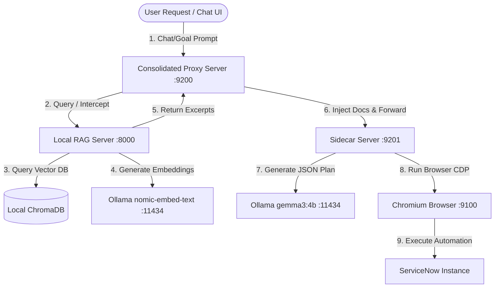

# ServiceNow AI Agent — System Architecture Specification v1.0

This document defines the system topology, component mapping, networking port configurations, and detailed data flow pipelines for the ServiceNow Task Planning Agent.

---

## 1. System Topology

The agent stack integrates BrowserOS browser automation with a local RAG retrieval system and a local Ollama LLM provider.



---

## 2. Component Mapping & Details

### A. BrowserOS Core & Extension
- **Role**: Coordinates the overall browser session. It mounts the developer-mode browser extension and registers user-facing tool callbacks.
- **Extension Path**: `C:\Users\Satis\AppData\Local\Chromium\User\Default\Extensions\nlnihljpboknmfagkikhkdblbedophja`

### B. Consolidated Proxy Server (`browseros_server.exe`)
- **Role**: Intercepts `/chat` requests sent from the client UI. If the query concerns ServiceNow (e.g. configuring LDAP, CMDB, catalog items), the proxy calls the RAG server, injects the procedural documentation as context in the prompt, and forwards it to the sidecar.
- **Port**: `9200`
- **Location**: `C:\Users\Satis\AppData\Local\Chromium\User Data\.browseros\versions\0.0.82\resources\bin\browseros_server.exe`

### C. Sidecar Server (`browseros_server_real.exe`)
- **Role**: The core automation executor. It translates LLM plan steps into actual CDP browser actions (click, fill, navigate, select option) on the Chromium instance.
- **Port**: `9201`
- **Location**: `C:\Users\Satis\AppData\Local\Chromium\User Data\.browseros\versions\0.0.82\resources\bin\browseros_server_real.exe`

### D. Local RAG Server (`local_rag_server.py`)
- **Role**: FastAPI-based knowledge retrieval API. Performs hybrid semantic lookup against ChromaDB for ServiceNow runbooks.
- **Port**: `8000`
- **Path**: `D:\knowledge_base\local_rag_server.py`

### E. Vector Database (ChromaDB)
- **Role**: Vector database housing 7,500+ pre-embedded chunks of official ServiceNow documentation and operational runbooks.
- **Path**: `D:\knowledge_base\final_chroma_db`

### F. Local Model Provider (Ollama)
- **Role**: Hosts the local LLMs. It generates document embeddings using `nomic-embed-text` and drives the agent's task planning using `gemma3:4b` or `llama3.1:8b`.
- **Port**: `11434`

---

## 3. Port Allocation

| Component | Port | Transport Protocol | Description |
|-----------|------|--------------------|-------------|
| **Ollama** | `11434` | HTTP / REST | Vector embedding and planning generation |
| **RAG Server** | `8000` | HTTP / REST | Hybrid documentation lookup |
| **Chromium CDP** | `9100` | WebSocket | Chrome DevTools Protocol browser automation |
| **Consolidated Proxy** | `9200` | HTTP / SSE / REST | RAG interception, prompt enhancement, and UI routing |
| **Sidecar Server** | `9201` | HTTP / SSE / REST | Browser tool execution and agent loop coordination |

---

## 4. Operational Data Flow

```
[User Goal Input]
       │
       ▼
[Proxy Server Interceptor] ──(ServiceNow check)──► [RAG Server (/retrieve)]
       │                                                    │
       │                                                    ▼
       │                                         [ChromaDB Vector Search]
       │                                                    │
       │                                                    ▼
       │                                          [Ollama nomic-embed-text]
       │                                                    │
       │                                                    ▼
       │                                        [Retrieve Relevant Runbooks]
       │                                                    │
       ▼                                                    ▼
[Enhance Prompt with Runbooks] ◄────────────────────────────┘
       │
       ▼
[Forward to Sidecar Server]
       │
       ▼
[Ollama gemma3:4b / api/generate] ──(Generate plan)──► [Valid JSON Plan]
       │                                                    │
       ▼                                                    ▼
[Browser tool execution] ◄──────────────────────────────────┘
       │
       ├─► Navigate to direct URL (e.g. /sys_script.do?sys_id=-1)
       ├─► Fill forms and click lookup icons
       ├─► Handle popup window transitions
       └─► Verify record submission
```

---

## 5. Differentiated Diagnostics Design

To prevent generic failure reporting, the system intercepts and parses exceptions during RAG execution:

1. **RAG Connection Offline**: Checked via TCP health check on port 8000. Provides exact shell commands to restart the uvicorn RAG service.
2. **Ollama Offline**: Intercepted when RAG embedding calls return a 500 error containing connection refused to `11434`. Instructs the user to run `ollama serve`.
3. **Database Lock**: SQLite file-lock error parsed from Chroma DB responses. Guides the user to release lock handles or restart the uvicorn process.
4. **Browsing Loops**: Prompt-enforced absolute caps (max 3 page opens, 2 extractions, 1 scroll) protect resources and stop the agent from cycling.
